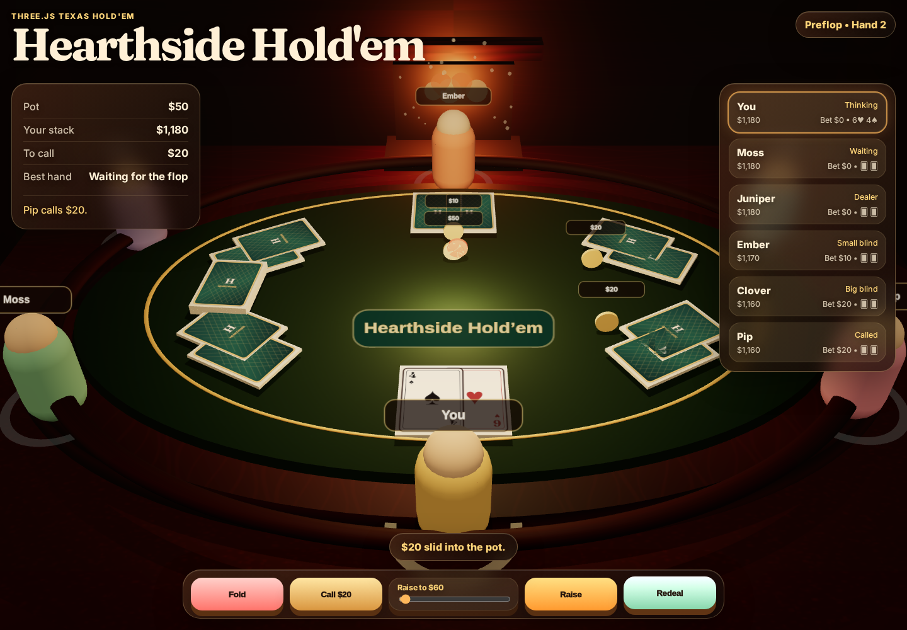

# Hearthside Hold'em — Cozy 3D Poker

**Hearthside Hold'em** is a cozy, polished Texas Hold'em poker clone built with **Three.js**, **TypeScript**, **Vite**, and **pnpm**. It turns a standard poker table into a warm fireside card room: glowing amber light, rich green felt, wood-and-brass materials, animated cards, chip movement, friendly bot opponents, and a readable HUD designed for quick play in the browser.

> Production URL: <https://cozy-holdem-threejs.vercel.app>



## Gameplay

- Play a single-player Texas Hold'em table against five bot opponents: Moss, Juniper, Ember, Clover, and Pip.
- Start each hand with rotating dealer, small blind, and big blind positions.
- Receive two private hole cards, then play through preflop, flop, turn, river, showdown, and redeal.
- Use the on-screen actions to fold, check/call, bet, raise, or start a new hand.
- Watch the pot, current call amount, your stack, opponents' stacks, visible board cards, and current best hand update live.

## Poker rules implemented

- 52-card deck with deterministic seeded shuffling for testability.
- Dealer rotation, blinds, betting rounds, checks/calls, bets/raises, folds, all-ins, and uncontested pots.
- Board runout when all remaining contenders are all-in before the river.
- Main-pot and side-pot payout logic for unequal all-in contributions.
- Full 7-card hand evaluation from high card through straight flush, including ace-low wheel straights and kicker tie-breaks.
- Split-pot handling for tied best hands.

## Visual and UX highlights

- Procedural 3D poker room built from Three.js primitives and canvas-generated textures.
- Cozy hearthside atmosphere with warm lighting, soft fog, green felt, polished wood, rugs, chip stacks, and subtle table details.
- Animated card dealing and chip movement hooks.
- Responsive WebGL canvas with an accessible HTML control overlay.
- Browser smoke/debug API exposed as `window.__hearthsideDebug` for deployment verification.

## Tech stack

- [Three.js](https://threejs.org/) for the 3D scene, materials, lighting, and animation.
- [Vite](https://vite.dev/) for fast development and static production builds.
- [TypeScript](https://www.typescriptlang.org/) for typed gameplay and rendering code.
- [Vitest](https://vitest.dev/) for deterministic poker-engine tests.
- [Playwright](https://playwright.dev/) for real-browser smoke verification.
- [pnpm](https://pnpm.io/) as the package manager.

## Project structure

```text
src/
  main.ts              Three.js scene, UI wiring, animations, debug hooks
  style.css            Cozy HUD and layout styling
  poker/
    cards.ts           Deck creation, seeded RNG, card labels/parsing
    evaluator.ts       7-card poker hand evaluator and score comparison
    game.ts            Hold'em game engine, betting, bots, side pots, runout
    types.ts           Shared poker/game TypeScript types
tests/
  evaluator.test.ts    Hand-category and tie-break regression tests
  game.test.ts         Round-flow and deterministic showdown tests
  allin-sidepot.test.ts All-in, side-pot, and big-blind option regressions
  browser-smoke.mjs    Browser smoke test and screenshot capture
```

## Run locally

```bash
pnpm install
pnpm dev
```

Open <http://127.0.0.1:5178/>.

## Production build

```bash
pnpm build
pnpm preview
```

Preview runs on <http://127.0.0.1:4178/> by default.

## Quality checks

```bash
pnpm test
pnpm build
pnpm smoke
```

The smoke test launches the real browser app, checks the debug API/canvas/game state, interacts with the table, redeals, and writes `docs/browser-smoke.png`.

## Verification performed before public release

- `pnpm test` — 11 tests passed across evaluator, game-flow, all-in runout, side-pot, and big-blind option suites.
- `pnpm build` — TypeScript and Vite production build succeeded.
- `pnpm smoke` — Playwright loaded the browser game, verified the title/debug API/canvas state/player cards, clicked through gameplay, redealt, and captured `docs/browser-smoke.png` with no page errors.

## Deployment

This app is configured for Vercel via `vercel.json`:

```json
{
  "buildCommand": "pnpm run build",
  "outputDirectory": "dist",
  "framework": "vite",
  "installCommand": "pnpm install --frozen-lockfile"
}
```

Once linked to Vercel, pushes to `main` deploy the static `dist/` build.

## License

MIT — see [LICENSE](LICENSE).
